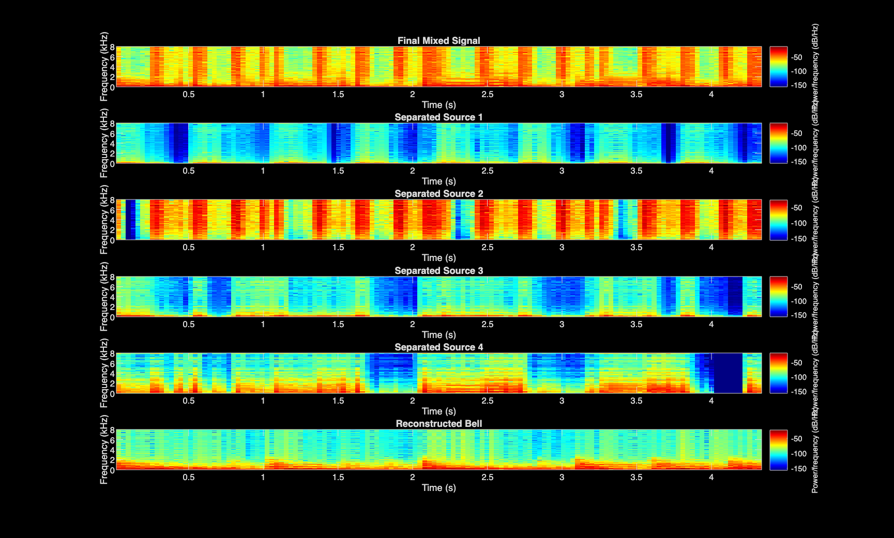

# 🎛 Robust Multi-Source Audio Separation under Controlled Interference

## 📌 Overview

This project investigates the robustness of Non-Negative Matrix Factorization (NMF)-based blind source separation under controlled interference conditions.

An additional source waveform (treated as structured noise) is intentionally injected into an existing audio mixture. The objective is to evaluate how effectively NMF can isolate original components in the presence of added spectral complexity.

Unlike standard blind separation, this experiment focuses on system resilience and decomposition behavior under artificially increased source density.

---

## 🎯 Objectives

- Introduce controlled interference (additional source waveform)
- Generate a composite multi-source signal
- Perform time-frequency analysis using STFT
- Apply NMF for blind component decomposition
- Evaluate separation robustness qualitatively and quantitatively

---

## ⚙️ Experimental Design

1. Load primary mixture signal
2. Load additional source waveform (treated as interference)
3. Inject waveform into mixture to simulate noise-like contamination
4. Compute magnitude spectrogram
5. Perform NMF decomposition (K components)
6. Reconstruct separated components
7. Analyze decomposition performance

---

## 📊 Results

### Separated Components

- `source1.wav`
- `source2.wav`
- `source3.wav`
- `source4.wav`

### Spectrogram Comparison



The decomposition demonstrates that:

- Structured harmonic components remain separable
- Interference manifests as an additional spectral basis
- NMF adapts by allocating basis vectors to distinct spectral patterns

---

## ▶ How to Run

1. Open MATLAB
2. Navigate to the project directory
3. Run:

```
multisource_separation_pipeline
```

The script automatically:
- Generates the interference-injected mixture
- Performs decomposition
- Saves reconstructed components in the `results/` directory

---

## 🛠 Tools & Concepts

- MATLAB
- Short-Time Fourier Transform (STFT)
- Non-Negative Matrix Factorization (NMF)
- Controlled Noise Injection
- Spectral Basis Decomposition
- Robustness Evaluation

---

## 🚀 Key Engineering Contribution

This project extends blind source separation by introducing controlled spectral interference, enabling evaluation of algorithm robustness in multi-source environments. It demonstrates practical understanding of decomposition stability under increased signal complexity.
